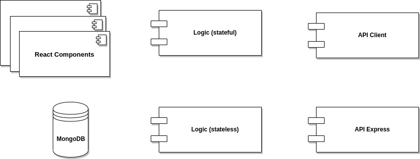

# SkyCall

## Description

SkyCall is an application designed for the management of a call center with numerous agents calling at the same time.
This application facilitates and speeds up the development of the calls, as well as the database update, also allowing the observation of the agents' performance in a comfortable way.

## Functional Description

The main features included in this application are:

1. Agent user can:

    - search clients by location 
    - create calls by client
    - create visits by client 
    - read and update client detail
    - check calls and visits by each client

2. Admin user can:

    - create, clients
    - check calls reports 
    - check agents reports
    - check general report 

## Technical Description

### Workflow

### Blocks

### Components

## Installation

To install this project go to [SkyCall](https://github.com/manoli2013/skycall.git) and clone it to your local repository.

## Credits

This project has been developed by [Noli Pascual](https://github.com/manoli2013).

